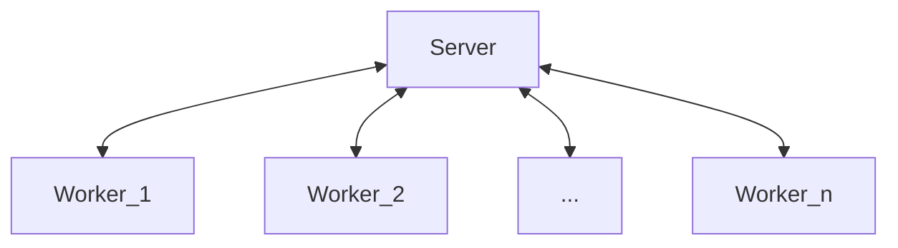

# server

<div align="center">
    
</div>

<br />

The server acts as a central point for the distributed training process. It is responsible for accepting connections from workers, keeping track of the current state of the training process, and coordinating that process by assigning tasks to workers and removing them if they refuse to participate within the worker timeout period.

## Environment Variables

The server is configurable via environment variables. The following configuration
options are available:

| Variable                | Options                                | Default | Description                                                                                 |
|-------------------------|----------------------------------------|---------|---------------------------------------------------------------------------------------------|
| `EVOCHI_JWT_SECRET`     | `string`                               | **required** | The secret to use for JWT tokens.                                                            |
| `EVOCHI_POPULATION_SIZE`| `uint`                                 | **required** | The size of the population to use.                                                            |
| `EVOCHI_LOG_LEVEL`      | `debug`, `info`, `warn`, or `error`    | `info` | The log level to use.                                                                        |
| `EVOCHI_SERVER_PORT`    | `uint`                                 | `8080` | The port to listen on.                                                                       |
| `EVOCHI_WORKER_TIMEOUT` | `duration`                             | `1m`   | The task and heartbeat timeout for workers.                                                 |
| `EVOCHI_MAX_WORKERS`    | `uint`                                 | `0`    | The maximum number of workers to run. If set to 0, no limit is set.                          |
| `EVOCHI_MAX_EPOCHS`     | `uint`                                 | `0`    | The maximum number of epochs to run. If set to 0, no limit is set.                           |

## Running

Binary releases are available on [GitHub](https://github.com/neuro-soup/evochi/releases).

To run from (master) source, the `go run` command can be used:

```bash
go run github.com/neuro-soup/evochi/server/cmd/server@latest
```

> [!IMPORTANT]
> The server requires some environment variables to be set, which can be found
> above.

**Full (Minimal) Example:**

```bash
EVOCHI_JWT_SECRET="secret" EVOCHI_POPULATION_SIZE=50 go run github.com/neuro-soup/evochi/cmd/evochi@latest
```

## Communication

The server uses [gRPC](https://grpc.io/) to communicate with workers and vice versa. Protobuf definition
files can be found in the [proto directory](../proto).



Workers and the server communicate bidirectionally. The server sends tasks in the form of events to the worker, and the worker completes the tasks and sends requests to the server with the respective task IDs.

When connecting, the worker receives a hello event containing the worker ID and a JWT token required for authentication. This JWT token must be included in all subsequent requests as [metadata (header)](https://grpc.io/docs/guides/metadata/):

```
authorization: Bearer <token>
```

If the worker is the first to join the workforce, the server sends it an initialise event requesting an initial state. The encoding of the state is up to the client; however, it must be consistent across all clients. For example, the Python client uses pickle to serialise the state class, and the resulting bytes are compressed using Zstandard.

Whenever the initialisation phase is over, the worker and other workers receive evaluation events iteratively, requesting them to evaluate one or more slices of the total population (reward) list. The implementation of these evaluations is left to the workers.

> [!IMPORTANT]
> The maximum size of the slices is equal to the worker's cores field set when connecting to the server.

As soon as all slices are completed, optimisation events are sent to all workers. After all workers have finished optimising, one is elected to send its current state to the server so that new workers can participate in the future.

The evaluation and optimization loop repeats as long as the maximum number of epochs has not been reached (configurable via environment variables). By default, no epoch limit is set.

## Fault Tolerance

Since this is a [client-server model](https://en.wikipedia.org/wiki/Client%E2%80%93server_model), the server itself represents a single point of failure. The task distribution to workers, however, is implemented in a fault-tolerant manner. As soon as a worker disconnects with a mission-critical task (such as initialization or evaluation), the task is delegated to other workers. If no other workers are available, the server is reset, and a new experiment can begin.

